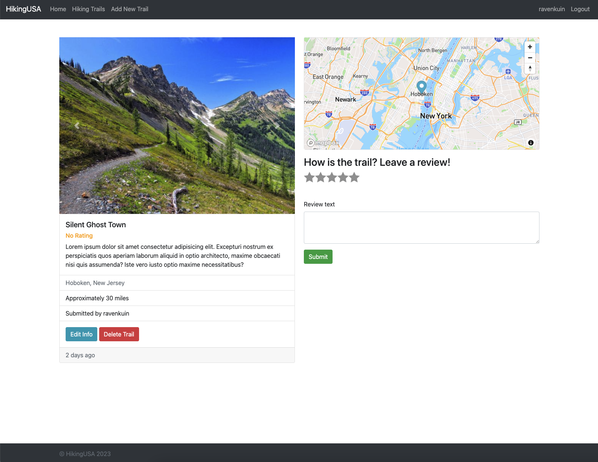

# Full Stack HikingUSA Project
## Introduction
Welcome to the HikingUSA project! This is a website presenting information about hiking trails in the USA.
- This is a full-stack web application with CRUD operations for users to add, view, update, and delete posts of hiking trails.

- Achieved features including user authentication through Passport, Google, and Facebook, geocoded cluster maps with Mapbox, trail rating, review posting, and image uploading.

- Deployed it to Render (PaaS): https://hikingusa.onrender.com/
- Set up front-end view engine using EJS with HTML/CSS/JavaScript; Integrated Mapbox APIs to generate a dynamic cluster map of trail locations based on geocoding

- Implemented RESTful APIs to handle HTTP requests and responses using Node.js and Express; Utilized MongoDB and AWS S3 for data storage